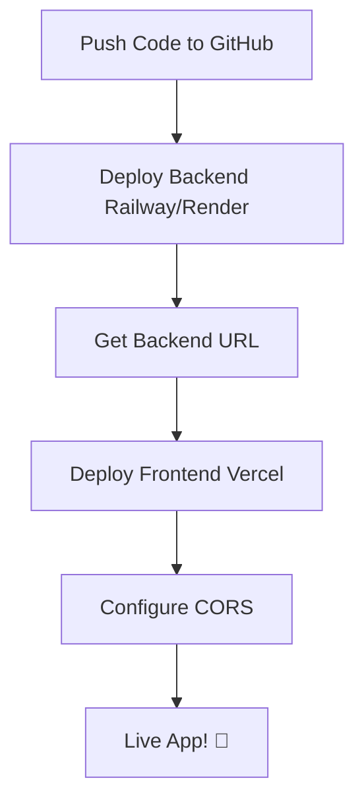

# 🎉 PlanCrick - Ready for FREE Deployment!

## ✅ What's Been Done

Your PlanCrick application has been fully configured for **FREE** deployment on modern cloud platforms!

### 🔧 Backend Changes (Server)

1. **✅ Migrated from SQL Server to PostgreSQL**
   - Changed `Microsoft.EntityFrameworkCore.SqlServer` → `Npgsql.EntityFrameworkCore.PostgreSQL`
   - Updated `Program.cs` to use `UseNpgsql()`
   - Updated connection string format in `appsettings.json`

2. **✅ Production Enhancements**
   - Auto-run migrations on startup in Production environment
   - Dynamic PORT binding (reads from environment variable)
   - Environment-based CORS configuration
   - Added `/health` endpoint for monitoring

3. **✅ Deployment Configurations**
   - Created `railway.json` for Railway.app deployment
   - Created `Procfile` for Render.com deployment
   - Created `.env.example` with required environment variables

4. **✅ Database Migrations**
   - Removed old SQL Server migrations
   - Created fresh PostgreSQL migrations

### 🎨 Frontend Changes (Client)

1. **✅ Environment Configuration**
   - Created `.env.example` for API URL configuration
   - Updated `vite.config.js` to support environment-based proxy
   - Created `src/config/api.js` for centralized API configuration

2. **✅ Deployment Configurations**
   - Created `vercel.json` for SPA routing
   - Ready for one-click Vercel deployment

### 📚 Documentation

1. **✅ Comprehensive Guides**
   - `DEPLOYMENT.md` - Full step-by-step deployment guide
   - `DEPLOYMENT_CHECKLIST.md` - Quick reference checklist
   - `README.md` - Updated with tech stack and deployment info

2. **✅ GitHub Integration**
   - `.github/workflows/deploy.yml` - CI/CD placeholder

### 🔒 Security

- Updated `.gitignore` to exclude:
  - `.env` files
  - `node_modules/`
  - Build artifacts

---

## 🚀 Next Steps - Deploy Your App!

### Time Required: **15-20 minutes**
### Cost: **$0.00 (100% FREE)**

### Option 1: Quick Deploy (Recommended)

Follow the **[DEPLOYMENT_CHECKLIST.md](./DEPLOYMENT_CHECKLIST.md)** for a quick deployment.

### Option 2: Full Guide

Read the complete **[DEPLOYMENT.md](./DEPLOYMENT.md)** for detailed instructions.

---

## 📋 Deployment Summary

| Component | Platform | Cost | Setup Time |
|-----------|----------|------|------------|
| **Frontend** | Vercel | FREE | 5 min |
| **Backend API** | Railway/Render | FREE | 7 min |
| **Database** | PostgreSQL (Railway/Render) | FREE | Included |

---

## 🎯 What You'll Get

### Free Tier Includes:

**Vercel (Frontend)**
- ✅ Unlimited bandwidth
- ✅ Custom domains
- ✅ SSL certificates
- ✅ Auto-deployment from Git
- ✅ Edge network (fast globally)

**Railway (Backend + DB)**
- ✅ $5 free credit/month (~500 hours)
- ✅ PostgreSQL database
- ✅ Auto-deployment from Git
- ✅ Environment variables
- ✅ Monitoring & logs

**Render (Alternative)**
- ✅ 750 hours/month free
- ✅ PostgreSQL database
- ✅ SSL certificates
- ✅ Auto-deployment from Git

---

## 📖 Deployment Order

### Simplified Steps:

1. **Backend First**
   - Railway/Render creates database automatically
   - Get your backend URL (e.g., `https://xxx.railway.app`)

2. **Frontend Second**
   - Set `VITE_API_URL` to your backend URL
   - Deploy to Vercel
   - Get your frontend URL (e.g., `https://xxx.vercel.app`)

3. **Connect Them**
   - Update backend `CORS_ORIGINS` with frontend URL
   - Test the app!

---

## 🔍 Testing Your Deployment

Once deployed, test these features:

- [ ] **Home page loads** correctly
- [ ] **Add a player** (tests POST /api/players)
- [ ] **View players** (tests GET /api/players)
- [ ] **Create fielding plan** (tests field visualization)
- [ ] **Save plan** (tests POST /api/plans)
- [ ] **Reload page** and verify plan persists (tests database)
- [ ] **Dashboard** shows saved plans

---

## 📞 Support

### If You Get Stuck:

1. **Check Logs**
   - Railway: Dashboard → Service → Logs
   - Render: Dashboard → Service → Logs
   - Vercel: Dashboard → Deployments → Logs

2. **Common Issues**
   - **CORS Error**: Check `CORS_ORIGINS` matches Vercel URL
   - **Database Error**: Verify connection string format
   - **404 on routes**: Check `vercel.json` is deployed

3. **Resources**
   - [Railway Docs](https://docs.railway.app/)
   - [Render Docs](https://render.com/docs)
   - [Vercel Docs](https://vercel.com/docs)

---

## 🎊 You're Ready!

Your PlanCrick app is **100% ready** for free deployment!

### Quick Links:
- 📝 [Deployment Checklist](./DEPLOYMENT_CHECKLIST.md) - Start here!
- 📖 [Full Deployment Guide](./DEPLOYMENT.md) - Read for details
- 🚀 [Railway](https://railway.app) - Backend hosting
- ⚡ [Vercel](https://vercel.com) - Frontend hosting

---

**Estimated Total Time**: 15-20 minutes  
**Estimated Cost**: $0.00 (completely FREE)  
**Difficulty**: Easy (just follow the checklist!)

Good luck! 🏏🚀

---

_Last Updated: 2026-02-04_
